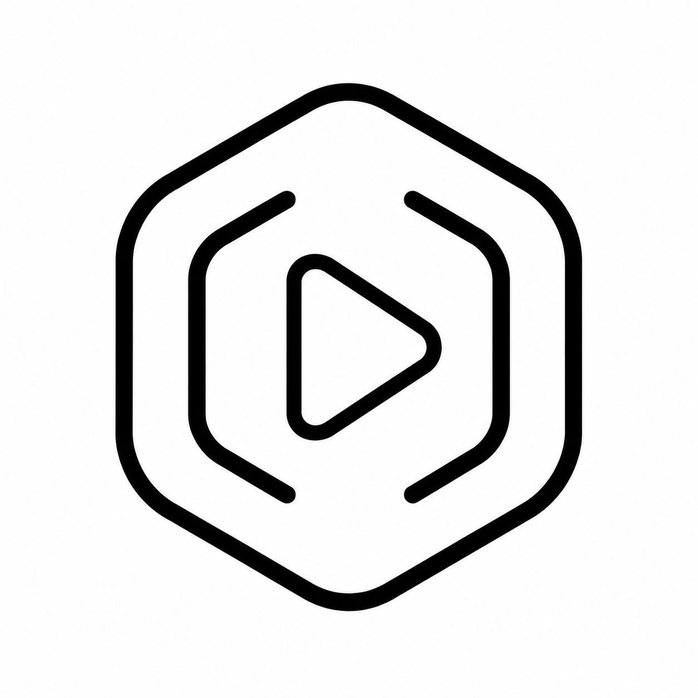

<div align="center">
  
  <h1>Open Player</h1>
  <p><strong>A high-performance, native Android video player built with Jetpack Compose, Material 3, and the MPV engine.</strong></p>

  <p>
    <a href="https://github.com/OpenFossy/OpenPlayer/releases"></a>
    <a href="https://github.com/OpenFossy/OpenPlayer/releases"></a>
    
    
    
    
    <a href="LICENSE"></a>
  </p>
</div>

---

## 📖 Overview

**Open Player** is a native, modern, and highly-customizable Android video player application. Re-engineered from the ground up around the battle-tested **MPV** media engine (`is.xyz.mpv`), Open Player delivers desktop-grade video decoding, hardware acceleration, zero-lag list rendering, and a fluid Material 3 interface.

---

## ✨ Key Features

### 🎬 Advanced Playback Engine (MPV)

- **Flexible Hardware Decoding:** Seamlessly switch between `Auto`, `Hardware (HW/HW+)`, and `Software (SW)` decoding modes on the fly.
- **Smart Video Enhancement:** Real-time hardware shader adjustments for Brightness, Contrast, Saturation, Gamma, and Hue.
- **Audio Boost & Management:** Amplify low-volume media up to 200% with intelligent volume normalization and pitch correction.
- **Rich Subtitle Controls:** Multi-track selection, subtitle synchronization delay tuning, custom styling (fonts, size, color, background, and screen offset).
- **Built-in `mpv.conf` Editor:** Integrated code editor (powered by Sora Editor) with syntax highlighting and auto-complete for advanced MPV scripting and property customization.

### 🎨 Modern Jetpack Compose UI

- **Material Design 3 & Dynamic Color:** Native theming tailored to your Android system palette.
- **AMOLED Dark Mode:** True pitch-black interface optimized for OLED displays and battery preservation.
- **Customizable Control Layouts:** Modular top and bottom player control panels with a visual layout editor.
- **Fluid Micro-Animations:** Dynamic progress indicators, smooth transitions, and responsive touch feedback.

### 👆 Intuitive Gesture Controls

- **Precision Seeking:** Horizontal slide gestures with configurable seek sensitivity.
- **Brightness & Volume Controls:** Vertical edge swipes with tactile HUD feedback.
- **Multi-Finger Actions:** Configurable 2-finger and 3-finger tap shortcuts (Play/Pause, Custom Speeds, Aspect Ratio).
- **Double-Tap & Long-Press:** Fast forward/rewind zones and instant 2x/3x speed boost during hold.

### ⚡ Performance & Optimization

- **Fast-Load Architecture:** MediaStore native thumbnail pre-rendering backed by Coil 3 and Room database metadata caching.
- **Zero-Jank Scrolling:** Fully asynchronous I/O and immutable state structures for 60/120fps list navigation.
- **Optimized Binary Size:** Modular ABI splits (`arm64-v8a`, `armeabi-v7a`, `x86`, `x86_64`) delivering a lightweight footprint (~24MB).

### 🌐 Network Streaming & Media Tools

- **Direct Stream URL Playback:** Stream remote videos with live buffer telemetry and network speed monitors.
- **Playback History & Resume:** Automatic position tracking and instant resume for local and streamed media.
- **Recycle Bin & Safe Delete:** Built-in trash management with soft-delete and restore capabilities.
- **Background Playback & PiP:** Continuous audio/video playback via system MediaSession with Picture-in-Picture support.

---

## 🛠️ Tech Stack

| Layer              | Technologies                                                       |
| :----------------- | :----------------------------------------------------------------- |
| **Language**       | Kotlin 100%                                                        |
| **UI Framework**   | Jetpack Compose, Material Design 3 (M3), Compose Navigation        |
| **Media Engine**   | MPV (`is.xyz.mpv` native JNI bindings)                             |
| **Async & State**  | Kotlin Coroutines, StateFlow, SharedFlow                           |
| **Image Loading**  | Coil 3 (`coil-compose`, `coil-video`)                              |
| **Local Database** | Room DB (Watch history, Metadata cache, Playback state)            |
| **Code Editor**    | Sora Editor (`sora-editor-core`, `sora-editor-textmate`)           |
| **Architecture**   | Modern Android Architecture (MVVM, Repositories, Clean State Flow) |

---

## 📥 Installation

Grab the latest APK tailored for your device architecture from the [Releases](https://github.com/OpenFossy/OpenPlayer/releases) page:

- **`arm64-v8a`**: Recommended for modern 64-bit Android smartphones & tablets.
- **`armeabi-v7a`**: For older 32-bit ARM devices.
- **`x86` / `x86_64`**: For Android emulators and Intel-based hardware.
- **`universal`**: Standalone APK supporting all architectures.

---

## 🏗️ Building from Source

### Prerequisites

- **Android Studio:** Ladybug (2024.2.1+) or newer
- **JDK:** Version 17+
- **Android SDK:** API Level 36 (Minimum API 26 / Android 8.0)
- **Gradle:** 8.11.1+

### Build Commands

```bash
# Clone the repository
git clone https://github.com/OpenFossy/OpenPlayer.git
cd OpenPlayer

# Build Debug APK
./gradlew assembleDebug

# Build Optimized Release APKs (Splits)
./gradlew assembleRelease
```

Generated APKs will be located in `app/build/outputs/apk/release/`.

---

## 🤝 Acknowledgements

Open Player is built on top of incredible open-source projects:

- [**mpv-android**](https://github.com/mpv-android/mpv-android) - Native Android port of the MPV media player.
- [**mpvRx**](https://github.com/Riteshp2001/mpvRx) by [**Ritesh Pandit (@Riteshp2001)**](https://github.com/Riteshp2001) - Inspiration for the in-app `mpv.conf` editor integration and thumbnail workflows.
- [**Nosved Player**](https://github.com/DevSon1024/Nosved-Player) by [**Devendra Sonawane (@DevSon1024)**](https://github.com/DevSon1024) - The foundational codebase and architectural origins of Open Player.
- [**Sora Editor**](https://github.com/Rosemoe/sora-editor) - Android code and text editor component.

---

## 📄 License

This project is open-source and licensed under the [MIT License](LICENSE).
